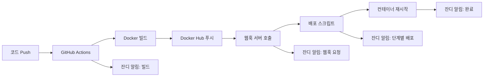

# 🚀 TestPark 종합 배포 및 협업 가이드

TestPark 프로젝트의 완전 자동화된 배포 시스템과 다중 로컬 환경 협업 가이드입니다.

## ⚡ Quick Start

### 🔥 가장 빠른 배포 방법
```bash
# 1. 자동 배포 (권장) - 최적화된 알림
git push origin master

# 2. 수동 배포 (긴급시)
curl -X POST https://carpenterhosting.cafe24.com/deploy

# 3. 로컬 배포 스크립트
cd /var/www/testpark && bash scripts/deploy.sh
```

### 📊 배포 상태 확인
```bash
# 서비스 상태 (TestPark)
curl https://carpenterhosting.cafe24.com/auth/login/

# 컨테이너 상태
docker ps -f name=testpark

# 웹훅 서버 상태
curl https://carpenterhosting.cafe24.com/health

# 네이버 로그인 콜백 확인
curl -I https://carpenterhosting.cafe24.com/auth/naver/callback/
```

## 🎯 최적화된 배포 알림 시스템

### 이전 vs 현재
| 구분 | 이전 | 현재 |
|------|------|------|
| **알림 개수** | 17-23개 | **4-5개** |
| **GitHub Actions** | 3개 분리 알림 | **1개 통합 알림** |
| **배포 스크립트** | 11-17개 상세 알림 | **3개 핵심 알림** |
| **헬스체크** | 6개 대기 알림 | **무음 처리** |

### 새로운 알림 구조
1. **🎉 빌드 성공 & 배포 시작** - GitHub Actions
2. **🚀 배포 시작** - 실서버 배포 프로세스 시작
3. **⚡ 배포 진행 중** - 중간 단계 요약
4. **🎉 배포 완료** - 최종 결과 + **실서버 확인 요청**
5. **❌ 배포 실패** (발생시만) - 상세 오류 정보

## 📋 목차

1. [🌿 다중 로컬 환경 브랜치 전략](#-다중-로컬-환경-브랜치-전략)
2. [🔄 배포 플로우 개요](#-배포-플로우-개요)
3. [⚙️ 서버 환경 구성](#-서버-환경-구성)
4. [🚀 배포 프로세스](#-배포-프로세스)
5. [🔐 네이버 로그인 설정](#-네이버-로그인-설정)
6. [📊 모니터링 및 관리](#-모니터링-및-관리)
7. [🛡️ 보안 설정](#-보안-설정)
8. [🐛 트러블슈팅](#-트러블슈팅)

## 🌿 다중 로컬 환경 브랜치 전략

### 개발 환경
- **샘맥북로컬1** (`sam`) - 메인 개발자
- **루크맥북로컬2** (`luke`) - 서브 개발자
- **루크윈도우로컬3** (`luke`) - 테스트 환경
- **실서버** (`carpenterhosting.cafe24.com`) - 프로덕션

### 브랜치 네이밍 규칙
```
{작업자}/{작업내용}
```

#### 예시
```bash
# 새 기능 개발
sam/user-dashboard
luke/payment-integration

# 버그 수정
sam/login-bug-fix
luke/session-timeout-fix

# 긴급 수정
sam/security-patch
luke/critical-fix
```

### 개발 워크플로우
```bash
# 1. 최신 master 동기화
git checkout master && git pull origin master

# 2. 작업 브랜치 생성
git checkout -b sam/new-feature

# 3. 개발 및 커밋
git add . && git commit -m "feat: 새 기능 구현"

# 4. 원격 브랜치 푸시
git push origin sam/new-feature

# 5. GitHub에서 PR 생성 → 리뷰 → 머지 → 자동 배포
```

**📖 상세 브랜치 전략:** [`docs/BRANCH_STRATEGY.md`](docs/BRANCH_STRATEGY.md)

## 🔄 배포 플로우 개요

### 전체 자동화 흐름



### 역할 분담

| 구성 요소 | 역할 | 트리거 조건 |
|-----------|------|-------------|
| **GitHub Actions** | 빌드 + Docker Hub 푸시 + 웹훅 호출 | `master/main` 브랜치 push |
| **웹훅 서버** | 배포 요청 수신 및 스크립트 실행 | 빌드 성공 후 웹훅 호출 |
| **배포 스크립트** | 실제 컨테이너 재배포 | 웹훅 서버를 통한 실행 |
| **잔디 알림** | 상세 단계별 상태 알림 | 전 과정 실시간 모니터링 |

### 🆕 단계별 배포 알림 시스템

배포 과정이 **5단계**로 세분화되어 각 단계마다 실시간 알림을 받을 수 있습니다:

1. **📥 Docker 이미지 풀** - 최신 이미지 다운로드
2. **🔄 기존 컨테이너 중지** - 무중단 서비스를 위한 기존 컨테이너 정리
3. **🏃 새 컨테이너 시작** - 새 이미지로 컨테이너 실행
4. **🔍 헬스체크** - 서비스 정상 작동 확인 (최대 30초)
5. **🧹 정리 작업** - 불필요한 이미지 정리

## 🛠️ GitHub Actions 설정

### 1. Repository Secrets 설정

GitHub 레포지토리의 `Settings` > `Secrets and variables` > `Actions`에서 다음 시크릿을 추가:

```bash
# Docker Hub 인증
DOCKER_USERNAME=your_dockerhub_username
DOCKER_PASSWORD=your_dockerhub_token

# 🆕 웹훅 서버 정보 (자동 배포용) - 카페24 실서버
WEBHOOK_DEPLOY_URL=https://carpenterhosting.cafe24.com
```

**⚠️ 중요: 카페24 웹훅 서버 설정**
- `WEBHOOK_DEPLOY_URL`은 카페24 도메인으로 설정합니다
- 형식: `https://carpenterhosting.cafe24.com` (HTTPS 사용)
- 웹훅 서버는 내부적으로 8080 포트에서 실행되며, 카페24 웹서버가 프록시 역할을 합니다
- 카페24 환경에서는 도메인 기반 라우팅이 필요할 수 있습니다

**🔐 소셜 로그인 설정**
- 네이버 로그인 콜백 URL: `https://carpenterhosting.cafe24.com/auth/naver/callback/`
- **중요**: 네이버 개발자 센터에서도 동일한 URL로 설정 변경 필요

### 2. GitHub Actions 워크플로우

현재 설정된 워크플로우는 `.github/workflows/ci-cd.yml`:

**🆕 개선된 주요 기능:**
- `master/main` 브랜치 push 시 자동 실행
- Docker 이미지 빌드 및 Docker Hub 푸시
- **웹훅 서버를 통한 실서버 자동 배포**
- **단계별 상세 배포 알림 시스템**
- 캐시 최적화 (GitHub Actions 캐시 사용)
- 실패 시 상세한 디버깅 정보 제공

**워크플로우 구성:**
1. **build-and-push 잡**: Docker 이미지 빌드, 푸시, 웹훅 서버 호출

**생성되는 이미지 태그:**
- `7171man/testpark:latest`
- `7171man/testpark:{commit-sha}`

## 🐳 Docker Hub 설정

### 1. Docker Hub 레포지토리 생성

1. [Docker Hub](https://hub.docker.com) 로그인
2. `Create Repository` 클릭
3. 레포지토리 이름: `testpark`
4. Public/Private 선택

### 2. Docker Hub Webhook 설정

1. Docker Hub 레포지토리 페이지에서 `Webhooks` 탭 클릭
2. `+` 버튼으로 새 웹훅 추가
3. 설정값:
   ```
   Webhook name: TestPark Auto Deploy
   Webhook URL: https://carpenterhosting.cafe24.com/webhook/dockerhub
   ```

### 3. Docker Hub 인증 토큰 생성

1. Docker Hub `Account Settings` > `Security`
2. `New Access Token` 생성
3. 권한: `Read, Write, Delete`
4. 생성된 토큰을 GitHub Secrets의 `DOCKER_PASSWORD`에 저장

## 🔐 네이버 로그인 설정

### ✅ 현재 설정 상태
- **허용된 콜백 URL**:
  - `http://localhost:8001/auth/naver/callback/` (로컬 개발용)
  - `https://carpenterhosting.cafe24.com/auth/naver/callback/` (실서버용)
- **아파치 프록시**: 통합 VirtualHost에서 `/auth/` → `localhost:8000/auth/` 자동 라우팅
- **테스트 결과**: ✅ 정상 동작 확인됨

### 네이버 개발자 센터 설정

**현재 설정이 올바르게 되어 있으니 변경할 필요 없음:**

1. **서비스 URL**: `https://carpenterhosting.cafe24.com`
2. **Callback URL**: `https://carpenterhosting.cafe24.com/auth/naver/callback/`

### 아파치 통합 설정
```apache
# 통합 VirtualHost에서 TestPark 네이버 로그인 자동 라우팅
ProxyPass /auth/ http://localhost:8000/auth/
ProxyPassReverse /auth/ http://localhost:8000/auth/
ProxyPreserveHost On
```

### 로그인 테스트
```bash
# 콜백 URL 응답 확인 (302 리다이렉트 = 정상)
curl -I https://carpenterhosting.cafe24.com/auth/naver/callback/

# 로그인 페이지 접근 확인
curl -I https://carpenterhosting.cafe24.com/auth/login/
```

**⚠️ 중요**: 실서버 배포 후 반드시 실제 네이버 로그인 플로우를 테스트해주세요!

## ⚙️ 서버 환경 구성

### 🏗️ 현재 인프라 상태
- **서버 IP**: 210.114.22.100
- **도메인**: carpenterhosting.cafe24.com
- **아파치**: 통합 VirtualHost (HTTP/HTTPS)
- **Docker**: TestPark 컨테이너 (포트 8000)
- **웹훅 서버**: Node.js (포트 8080)
- **SSL**: Let's Encrypt 인증서

### 🔗 아파치 통합 설정

#### 장점
- ✅ **단일 파일 관리**: `/etc/apache2/sites-available/unified-vhost.conf`
- ✅ **일관된 설정**: HTTP/HTTPS 모두 동일한 프록시 규칙
- ✅ **유지보수 용이**: 한 곳에서 모든 설정 관리
- ✅ **설정 누락 방지**: 중복 설정 제거

#### 프록시 설정
```apache
# TestPark (네이버 로그인 포함)
ProxyPass /auth/ http://localhost:8000/auth/

# 웹훅 서버 (배포 시스템)
ProxyPass /deploy-from-github http://localhost:8080/deploy-from-github
ProxyPass /webhook/dockerhub http://localhost:8080/webhook/dockerhub
ProxyPass /deploy http://localhost:8080/deploy
ProxyPass /health http://localhost:8080/health

# 기존 프로젝트
WSGIScriptAlias /intea (intea 프로젝트)
WSGIScriptAlias /PMIS (PMIS 프로젝트)
```

### 📦 Docker 환경
```bash
# TestPark 컨테이너 상태 확인
docker ps -f name=testpark

# 컨테이너 로그 확인
docker logs testpark -f

# 컨테이너 재시작 (필요시)
docker restart testpark
```

## 🔗 웹훅 서버 설정

### 1. 웹훅 서버 설치 및 실행

```bash
# 시스템 서비스로 등록
sudo cp scripts/webhook.service /etc/systemd/system/
sudo systemctl daemon-reload
sudo systemctl enable webhook
sudo systemctl start webhook

# 상태 확인
sudo systemctl status webhook
```

### 2. 웹훅 서버 기능

| 엔드포인트 | 메서드 | 기능 | 설명 |
|------------|--------|------|------|
| `/deploy-from-github` | POST | GitHub Actions 배포 | GitHub Actions에서 호출하는 자동 배포 |
| `/webhook/dockerhub` | POST | Docker Hub 웹훅 수신 | `latest` 태그 푸시 시 자동 배포 |
| `/deploy` | POST | 수동 배포 | 필요시 수동으로 배포 실행 |
| `/health` | GET | 헬스체크 | 서버 상태 확인 |

### 3. 카페24 환경 설정

#### 프록시 설정 (필수)
카페24 환경에서는 웹 서버(Apache/Nginx)에서 Node.js 웹훅 서버로 프록시 설정이 필요합니다:

**Apache 설정 예시 (.htaccess 또는 VirtualHost):**
```apache
# 웹훅 관련 요청을 Node.js 서버로 프록시
ProxyPass /deploy-from-github http://localhost:8080/deploy-from-github
ProxyPass /webhook/dockerhub http://localhost:8080/webhook/dockerhub
ProxyPass /deploy http://localhost:8080/deploy
ProxyPass /health http://localhost:8080/health

ProxyPassReverse /deploy-from-github http://localhost:8080/deploy-from-github
ProxyPassReverse /webhook/dockerhub http://localhost:8080/webhook/dockerhub
ProxyPassReverse /deploy http://localhost:8080/deploy
ProxyPassReverse /health http://localhost:8080/health
```

**Nginx 설정 예시:**
```nginx
location /deploy-from-github {
    proxy_pass http://localhost:8080/deploy-from-github;
    proxy_set_header Host $host;
    proxy_set_header X-Real-IP $remote_addr;
}

location /webhook/dockerhub {
    proxy_pass http://localhost:8080/webhook/dockerhub;
    proxy_set_header Host $host;
    proxy_set_header X-Real-IP $remote_addr;
}

location /deploy {
    proxy_pass http://localhost:8080/deploy;
    proxy_set_header Host $host;
    proxy_set_header X-Real-IP $remote_addr;
}

location /health {
    proxy_pass http://localhost:8080/health;
    proxy_set_header Host $host;
    proxy_set_header X-Real-IP $remote_addr;
}
```

#### 방화벽 설정
```bash
# 카페24 환경에서는 일반적으로 내부 포트만 열면 됨
# 8080 포트는 localhost에서만 접근 가능하도록 설정
sudo ufw allow from 127.0.0.1 to any port 8080

# 웹 서버 포트 (이미 열려있을 수 있음)
sudo ufw allow 80/tcp
sudo ufw allow 443/tcp
```

## 📱 알림 설정

### 1. 잔디 웹훅 URL

프로젝트에 설정된 잔디 웹훅:
- **통합 알림**: `https://wh.jandi.com/connect-api/webhook/15016768/83760d2c508acfed35c1944e8a199f9b`
  - GitHub Actions 빌드 상태
  - 실서버 배포 단계별 진행상황
  - 전체 배포 완료/실패 알림

### 2. 🆕 상세 알림 종류

#### GitHub Actions 단계
| 상황 | 알림 색상 | 내용 |
|------|-----------|------|
| **빌드 성공** | 🟢 초록색 | 커밋 정보, 브랜치, 이미지 태그 + 다음 단계 안내 |
| **빌드 실패** | 🔴 빨간색 | 오류 정보, 커밋 정보, 로그 링크 |

#### 배포 스크립트 단계 (5단계)
| 단계 | 상황 | 알림 색상 | 내용 |
|------|------|-----------|------|
| **배포 시작** | 시작 | 🟡 노란색 | 배포 시작 알림, 예상 소요시간 |
| **1단계** | 이미지 풀 | 🔵 파란색 → 🟢 초록색 | Docker 이미지 다운로드 진행상황 |
| **2단계** | 컨테이너 중지 | 🟠 주황색 → 🟢 초록색 | 기존 컨테이너 정리 |
| **3단계** | 컨테이너 시작 | 🟣 보라색 → 🟢 초록색 | 새 컨테이너 시작 및 ID 정보 |
| **4단계** | 헬스체크 | 🔵 청록색 → 🟢 초록색 | 서비스 응답 확인 (최대 30초) |
| **5단계** | 정리 작업 | 🔘 회색 → 🟢 초록색 | 불필요한 이미지 정리 |
| **배포 완료** | 성공 | 🔵 파란색 | 전체 요약 정보 (컨테이너 ID, 업타임 등) |
| **배포 실패** | 실패 | 🔴 빨간색 | 실패 단계, 로그 정보, 수동 복구 방법 |

#### 헬스체크 세부 알림
- **대기 중**: 🟡 노란색 (진행률 표시: 1/6, 2/6 등)
- **성공**: 🟢 초록색 (서비스 URL, 컨테이너 정보)
- **실패**: 🔴 빨간색 (오류 로그, 문제 해결 방법)

## 🚀 배포 프로세스

### 🆕 자동 배포 (권장)

1. **코드 변경 후 푸시**
   ```bash
   git add .
   git commit -m "feature: 새 기능 추가"
   git push origin master
   ```

2. **🆕 자동 실행 순서 (완전 자동화)**
   ```
   📤 코드 Push to master
   ↓
   🔄 GitHub Actions 빌드 트리거
   ├── 🐳 Docker 이미지 빌드
   ├── 📤 Docker Hub 푸시
   └── 🎉 빌드 성공 알림
   ↓
   🔗 웹훅 서버 호출로 실서버 배포 스크립트 실행
   ├── ✅ 웹훅 요청 성공 알림
   ├── 📥 1단계: Docker 이미지 풀 (진행 알림)
   ├── 🔄 2단계: 기존 컨테이너 중지 (진행 알림)
   ├── 🏃 3단계: 새 컨테이너 시작 (진행 알림)
   ├── 🔍 4단계: 헬스체크 (실시간 대기 알림)
   ├── 🧹 5단계: 정리 작업 (진행 알림)
   └── 🎉 배포 완료 알림 (상세 정보 포함)
   ```

3. **실시간 모니터링**
   - 각 단계마다 잔디 알림으로 실시간 진행상황 확인
   - 헬스체크 중에는 5초마다 진행률 업데이트
   - 실패 시 상세한 오류 정보와 복구 방법 제공

### 수동 배포

긴급한 경우 다음 3가지 방법으로 수동 배포 가능:

#### 🆕 방법 1: 웹훅 서버를 통한 배포 (가장 편리)
```bash
# 웹훅 서버를 통한 원격 배포 (추천)
curl -X POST https://carpenterhosting.cafe24.com/deploy

# GitHub Actions 방식으로 배포 (더 상세한 로깅)
curl -X POST https://carpenterhosting.cafe24.com/deploy-from-github \
  -H "Content-Type: application/json" \
  -d '{
    "project": "testpark",
    "commit": "manual-deploy",
    "branch": "master",
    "image": "7171man/testpark:latest",
    "trigger": "manual"
  }'

# 응답으로 배포 결과를 JSON 형태로 받을 수 있습니다
# 성공 시: {"success":true,"message":"Manual deployment successful","output":"..."}
# 실패 시: {"success":false,"message":"Manual deployment failed","error":"..."}
```

#### 방법 2: 배포 스크립트 직접 실행
```bash
# 서버에 직접 접속하여 실행
cd /var/www/testpark
bash scripts/deploy.sh

# 상세한 단계별 알림과 함께 배포가 진행됩니다
# 각 단계의 성공/실패를 잔디로 실시간 확인 가능
```

#### 방법 3: Docker Hub 웹훅 트리거
```bash
# Docker Hub에서 latest 태그가 푸시되면 자동 배포
# 또는 수동으로 웹훅 테스트:
curl -X POST https://carpenterhosting.cafe24.com/webhook/dockerhub \
  -H "Content-Type: application/json" \
  -d '{"push_data":{"tag":"latest"},"repository":{"repo_name":"testpark"}}'
```

### 🆕 배포 확인

```bash
# 1. 컨테이너 상태 확인
docker ps -f name=testpark

# 2. 애플리케이션 접속 확인
curl http://localhost:8000/

# 3. 상세 컨테이너 정보 확인
docker inspect testpark --format='{{.State.Status}}'
docker inspect testpark --format='{{.State.StartedAt}}'

# 4. 로그 확인 (실시간)
docker logs testpark -f

# 5. 배포 결과 요약 보기
docker ps -f name=testpark --format "table {{.Names}}\t{{.Status}}\t{{.Ports}}"
```

### 🆕 배포 모니터링

배포 과정에서 다음 정보들을 실시간으로 확인할 수 있습니다:

```bash
# 배포 중 실시간 상태 체크
watch -n 2 'docker ps -f name=testpark'

# 배포 완료 후 서비스 확인
curl -I http://localhost:8000/
```

## 📊 모니터링 및 관리

### 시스템 상태 모니터링

#### 서비스 상태 확인
```bash
# 전체 서비스 상태 한번에 확인
echo "=== TestPark 서비스 상태 ===" && \
echo "1. 애플리케이션:" && curl -s http://localhost:8000/ && \
echo -e "\n2. 웹훅 서버:" && curl -s https://carpenterhosting.cafe24.com/health && \
echo -e "\n3. 컨테이너 상태:" && docker ps -f name=testpark --format "table {{.Names}}\t{{.Status}}\t{{.Ports}}"
```

#### 로그 모니터링
```bash
# 실시간 애플리케이션 로그
docker logs testpark -f

# 웹훅 서버 로그 (systemd 사용 시)
sudo journalctl -u testpark-webhook -f

# 최근 배포 로그만 확인
docker logs testpark --since="10m"
```

#### 리소스 사용량 확인
```bash
# 컨테이너 리소스 사용량
docker stats testpark --no-stream

# 전체 시스템 리소스
df -h / && free -h && uptime
```

### 웹훅 서버 관리

#### 웹훅 서버 상태 관리
```bash
# 웹훅 서버 프로세스 확인
ps aux | grep webhook-server.js

# 포트 사용 확인
netstat -tlnp | grep 8080

# 웹훅 서버 재시작 (필요시)
pkill -f webhook-server.js
cd /var/www/testpark && nohup node scripts/webhook-server.js > webhook.log 2>&1 &
```

#### 웹훅 엔드포인트 테스트
```bash
# 헬스체크
curl https://carpenterhosting.cafe24.com/health

# 수동 배포 테스트
curl -X POST https://carpenterhosting.cafe24.com/deploy

# Docker Hub 웹훅 테스트
curl -X POST https://carpenterhosting.cafe24.com/webhook/dockerhub \
  -H "Content-Type: application/json" \
  -d '{"push_data":{"tag":"latest"},"repository":{"repo_name":"testpark"}}'
```

### 배포 이력 및 버전 관리

#### 현재 배포 버전 확인
```bash
# 현재 실행 중인 이미지 정보
docker inspect testpark --format='{{.Config.Image}}'
docker inspect testpark --format='{{.Image}}' | cut -c8-19

# 컨테이너 시작 시간
docker inspect testpark --format='{{.State.StartedAt}}'

# 최근 배포 커밋 정보 (GitHub에서)
git log --oneline -5
```

#### 이미지 관리
```bash
# 모든 testpark 이미지 확인
docker images | grep testpark

# 사용하지 않는 이미지 정리
docker image prune -f

# 특정 태그 이미지 삭제 (필요시)
docker rmi 7171man/testpark:old-tag
```

### 백업 및 복구

#### 설정 파일 백업
```bash
# 중요 설정 파일들 백업
tar -czf testpark-config-$(date +%Y%m%d).tar.gz \
  .github/workflows/ci-cd.yml \
  scripts/ \
  Dockerfile \
  docker-compose.yml \
  DEPLOYMENT.md
```

#### 이전 버전으로 롤백
```bash
# 이전 이미지로 롤백 (예시)
docker stop testpark && docker rm testpark
docker run -d --name testpark -p 8000:8000 7171man/testpark:previous-tag

# 또는 특정 커밋 SHA로 롤백
docker run -d --name testpark -p 8000:8000 7171man/testpark:commit-sha
```

### 성능 최적화

#### 컨테이너 최적화
```bash
# 컨테이너 메모리 사용량 제한 (필요시)
docker stop testpark && docker rm testpark
docker run -d --name testpark -p 8000:8000 --memory="512m" 7171man/testpark:latest

# 컨테이너 재시작 정책 확인
docker inspect testpark --format='{{.HostConfig.RestartPolicy}}'
```

#### 배포 속도 개선
```bash
# Docker 빌드 캐시 활용 상태 확인
docker system df

# 네트워크 속도 테스트 (Docker Hub)
time docker pull 7171man/testpark:latest
```

### 보안 관리

#### 접근 권한 확인
```bash
# 파일 권한 확인
ls -la /var/www/testpark/scripts/

# 웹훅 서버 접근 제한 (방화벽)
sudo ufw status | grep 8080
```

#### 시크릿 정보 관리
```bash
# GitHub Secrets 사용 현황 (GitHub 웹에서 확인)
# - DOCKER_USERNAME
# - DOCKER_PASSWORD
# - PROD_HOST
# - PROD_USER
# - PROD_SSH_KEY

# 로컬 환경 변수 확인 (웹훅 서버)
ps aux | grep webhook-server.js | grep -o "Environment=[^[:space:]]*"
```

## 🐛 트러블슈팅

### GitHub Actions 문제

#### 빌드 실패 시
```bash
# 1. Secrets 확인
# GitHub 레포지토리 > Settings > Secrets 확인

# 2. Dockerfile 문법 확인
docker build -t test-image .

# 3. 의존성 문제 확인
# requirements.txt 또는 package.json 확인
```

#### Docker Hub 푸시 실패 시
```bash
# 1. Docker Hub 로그인 확인
docker login

# 2. 레포지토리 권한 확인
# Docker Hub에서 레포지토리 public/private 설정 확인

# 3. 토큰 권한 확인
# Docker Hub > Account Settings > Security에서 토큰 권한 확인
```

### 웹훅 서버 문제

#### 웹훅 서버가 응답하지 않을 때
```bash
# 서비스 상태 확인
sudo systemctl status webhook

# 서비스 재시작
sudo systemctl restart webhook

# 로그 확인
sudo journalctl -u webhook -f

# 포트 확인
netstat -tlnp | grep 8080
```

#### Docker Hub 웹훅이 오지 않을 때
```bash
# 1. 웹훅 URL 확인
# Docker Hub > 레포지토리 > Webhooks에서 URL 확인

# 2. 방화벽 확인
sudo ufw status

# 3. 수동 테스트
curl -X POST https://carpenterhosting.cafe24.com/webhook/dockerhub \
  -H "Content-Type: application/json" \
  -d '{"push_data":{"tag":"latest"},"repository":{"repo_name":"testpark"}}'
```

### 배포 스크립트 문제

#### 컨테이너 시작 실패 시
```bash
# 1. 이미지 확인
docker images | grep testpark

# 2. 포트 충돌 확인
sudo netstat -tlnp | grep 3000

# 3. 컨테이너 로그 확인
docker logs testpark

# 4. 수동 컨테이너 실행 테스트
docker run -d --name test-testpark -p 3000:3000 7171man/testpark:latest
```

#### 헬스체크 실패 시
```bash
# 1. 애플리케이션 로그 확인
docker logs testpark

# 2. 헬스체크 엔드포인트 확인
curl http://localhost:3000/health

# 3. 포트 바인딩 확인
docker port testpark
```

### 네트워크 문제

#### 외부에서 웹훅 접근 불가 시
```bash
# 1. 방화벽 확인 및 열기
sudo ufw allow 8080/tcp
sudo ufw reload

# 2. 서버 IP 확인
curl ifconfig.me

# 3. 포트 리스닝 확인
sudo netstat -tlnp | grep :8080

# 4. 웹훅 URL 테스트
curl http://your-server-ip:8080/health
```

### 소셜 로그인 문제

#### 네이버 로그인이 작동하지 않을 때
```bash
# 1. 콜백 URL 설정 확인
# 네이버 개발자 센터와 코드 설정이 일치하는지 확인

# 2. HTTPS 인증서 확인
curl -I https://carpenterhosting.cafe24.com

# 3. 콜백 엔드포인트 테스트
curl -I https://carpenterhosting.cafe24.com/auth/naver/callback/

# 4. Django 설정 확인
python manage.py shell
>>> from django.conf import settings
>>> print(settings.NAVER_REDIRECT_URI)
```

#### 네이버 로그인 에러 해결
```bash
# 자주 발생하는 오류들:

# 1. "redirect_uri_mismatch" 오류
# → 네이버 개발자 센터의 Callback URL과 코드의 NAVER_REDIRECT_URI가 다름
# → 해결: 두 설정을 정확히 일치시키기

# 2. "SSL certificate problem" 오류
# → HTTPS 인증서 문제
# → 해결: 카페24에서 SSL 인증서 설정 확인

# 3. "invalid_client" 오류
# → CLIENT_ID 또는 CLIENT_SECRET 오류
# → 해결: 네이버 개발자 센터에서 키 값 재확인
```

**🔧 네이버 로그인 설정 체크리스트:**
- [ ] 네이버 개발자 센터 서비스 URL: `https://carpenterhosting.cafe24.com`
- [ ] 네이버 개발자 센터 Callback URL: `https://carpenterhosting.cafe24.com/auth/naver/callback/`
- [ ] Django NAVER_REDIRECT_URI: `https://carpenterhosting.cafe24.com/auth/naver/callback/`
- [ ] HTTPS 인증서 정상 작동
- [ ] CLIENT_ID, CLIENT_SECRET 정확성

## 🆕 배포 추적 및 로깅 시스템 (v3.0.0)

### 새로운 기능 (2025-10-13 업데이트)

#### ✨ 주요 개선사항

1. **⏰ 한국 시간(KST) 표시**
   - GitHub Actions 알림에 배포 시작 시각 표시
   - 모든 알림에 KST 타임스탬프 포함

2. **📝 커밋 정보 상세 표시**
   - 커밋 메시지 전체 내용
   - 커밋 작성자 이름
   - 브랜치 정보

3. **👤 수동 배포 추적**
   - 배포 요청자 이름 기록
   - 요청 IP 주소 로깅
   - 잔디 알림으로 즉시 통지

4. **📊 배포 이력 로깅**
   - 모든 배포 이력을 JSON 형식으로 저장
   - 자동/수동 배포 구분
   - 시간, 커밋, 요청자 등 모든 정보 기록

5. **🔍 배포 로그 조회 API**
   - 웹 API로 배포 이력 조회
   - 최근 N개 배포 조회 가능

### 배포 이력 조회 방법

#### API를 통한 조회

```bash
# 최근 50개 배포 이력 조회 (기본값)
curl https://carpenterhosting.cafe24.com/deploy-logs

# 최근 10개만 조회
curl https://carpenterhosting.cafe24.com/deploy-logs?limit=10

# JSON 형식으로 예쁘게 보기
curl -s https://carpenterhosting.cafe24.com/deploy-logs | python3 -m json.tool
```

#### 응답 예시

```json
{
  "success": true,
  "count": 2,
  "logs": [
    {
      "timestamp": "2025. 10. 13. 오후 3:45:12",
      "data": {
        "type": "github_actions",
        "project": "testpark",
        "commit": "abc1234567890...",
        "branch": "master",
        "message": "feat: 새로운 기능 추가",
        "author": "park6711",
        "deployTime": "2025-10-13 15:45:12",
        "trigger": "github_actions"
      }
    },
    {
      "timestamp": "2025. 10. 13. 오후 2:30:45",
      "data": {
        "type": "manual_deploy",
        "deployTime": "2025-10-13 14:30:45",
        "requestIP": "::ffff:127.0.0.1",
        "requestUser": "park6711",
        "commit": "def9876543210...",
        "branch": "master",
        "message": "fix: 버그 수정",
        "author": "park6711"
      }
    }
  ]
}
```

#### 로그 파일 직접 조회

```bash
# 전체 배포 이력 확인
cat /var/www/testpark/logs/deploy-history.log

# 최근 10개만
tail -10 /var/www/testpark/logs/deploy-history.log

# 특정 날짜 배포만 검색
grep "2025-10-13" /var/www/testpark/logs/deploy-history.log

# 수동 배포만 필터링
grep "manual_deploy" /var/www/testpark/logs/deploy-history.log

# GitHub Actions 배포만 필터링
grep "github_actions" /var/www/testpark/logs/deploy-history.log

# 특정 사용자의 배포만 검색
grep "park6711" /var/www/testpark/logs/deploy-history.log
```

### 수동 배포 스크립트 사용법

```bash
cd /var/www/testpark
./manual-deploy.sh
```

**실행 과정:**
1. 배포 요청자 이름 입력 (Enter시 현재 사용자명 사용)
2. 배포 확인 프롬프트 (y/N)
3. 웹훅 서버로 요청 전송
4. 잔디에서 실시간 배포 진행 상황 확인

**잔디 알림 내용:**
- ⚠️ 수동 배포 표시 (자동 배포와 구분)
- ⏰ 배포 시각 (한국 시간)
- 👤 요청자 이름
- 🌐 요청 IP 주소
- 📝 현재 커밋 정보

### 배포 원인 추적 예시

#### 사례: 10월 12일 밤 10시 55분 배포 원인 파악

```bash
# 1. 배포 로그에서 해당 시간대 검색
grep "2025-10-12.*22:" /var/www/testpark/logs/deploy-history.log

# 2. API로 해당 날짜 배포 조회
curl -s "https://carpenterhosting.cafe24.com/deploy-logs?limit=100" | \
  python3 -m json.tool | grep -A 10 "2025-10-12"

# 3. GitHub Actions 실행 이력 확인
gh run list --limit 20 --json createdAt,displayTitle,conclusion

# 4. 커밋 이력과 비교
git log --since="2025-10-12 22:00" --until="2025-10-12 23:00"
```

### 웹훅 서버 v3.0.0 새로운 기능

#### 배포 이력 자동 로깅
- 모든 배포 요청이 자동으로 `/var/www/testpark/logs/deploy-history.log`에 기록
- JSON 형식으로 구조화된 데이터 저장
- 타임스탬프는 한국 시간(KST) 기준

#### 배포 로그 조회 API
- GET `/deploy-logs?limit=N`: 최근 N개 배포 이력 조회
- GET `/health`: 웹훅 서버 상태 및 버전 정보

#### 향상된 잔디 알림
- 배포 시작, 진행, 완료 단계별 상세 알림
- 수동/자동 배포 구분 표시
- 요청자 및 IP 정보 포함

### 웹훅 서버 관리

```bash
# 서버 상태 확인
curl -s https://carpenterhosting.cafe24.com/health | python3 -m json.tool

# 프로세스 확인
ps aux | grep "node.*webhook-server"

# 서버 재시작 (업데이트 후)
pkill -f "node.*webhook-server"
mkdir -p logs
nohup node scripts/webhook-server.js > logs/webhook-server.log 2>&1 &

# 로그 확인
tail -f logs/webhook-server.log
```

### 트러블슈팅

#### 배포 로그가 기록되지 않을 때
```bash
# 1. 로그 디렉토리 확인
ls -la /var/www/testpark/logs/

# 2. 로그 디렉토리 생성 (없을 경우)
mkdir -p /var/www/testpark/logs

# 3. 권한 확인
chmod 755 /var/www/testpark/logs

# 4. 웹훅 서버 재시작
pkill -f webhook-server && nohup node scripts/webhook-server.js > logs/webhook-server.log 2>&1 &
```

#### 배포 시간이 이상하게 표시될 때
- 모든 시간은 한국 시간(KST, UTC+9) 기준입니다
- GitHub Actions는 UTC 시간으로 실행되지만, 알림은 KST로 변환되어 전송됩니다
- 서버 시간대 확인: `timedatectl` 또는 `date`

## 📚 참고 자료

### 배포 관련
- [Docker Hub Webhooks 문서](https://docs.docker.com/docker-hub/webhooks/)
- [GitHub Actions 문서](https://docs.github.com/en/actions)
- [잔디 웹훅 API](https://support.jandi.com/hc/ko/articles/360002056791)

### 소셜 로그인 관련
- [네이버 개발자 센터](https://developers.naver.com/apps/)
- [네이버 로그인 API 문서](https://developers.naver.com/docs/login/web/)
- [네이버 로그인 가이드](./docs/NAVER_LOGIN_GUIDE.md)

## 🤝 기여하기

배포 시스템 개선 제안이나 문제 발견 시:

1. Issue 생성
2. Pull Request 제출
3. 배포 가이드 업데이트

---

**📞 문의:** 배포 관련 문제 시 개발팀에 연락 또는 Issue 등록