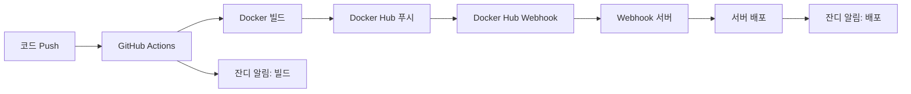

# 🚀 TestPark 배포 가이드

TestPark 프로젝트의 자동화된 배포 시스템에 대한 완전한 가이드입니다.

## 📋 목차

1. [배포 플로우 개요](#-배포-플로우-개요)
2. [GitHub Actions 설정](#-github-actions-설정)
3. [Docker Hub 설정](#-docker-hub-설정)
4. [서버 환경 구성](#-서버-환경-구성)
5. [웹훅 서버 설정](#-웹훅-서버-설정)
6. [알림 설정](#-알림-설정)
7. [배포 프로세스](#-배포-프로세스)
8. [트러블슈팅](#-트러블슈팅)

## 🔄 배포 플로우 개요

### 전체 자동화 흐름



### 역할 분담

| 구성 요소 | 역할 | 트리거 조건 |
|-----------|------|-------------|
| **GitHub Actions** | 빌드 + Docker Hub 푸시 | `master/main` 브랜치 push |
| **Docker Hub Webhook** | 배포 트리거 | `latest` 태그 푸시 감지 |
| **Webhook 서버** | 실제 서버 배포 | Docker Hub webhook 수신 |
| **잔디 알림** | 각 단계별 상태 알림 | 빌드 성공/실패, 배포 성공/실패 |

## 🛠️ GitHub Actions 설정

### 1. Repository Secrets 설정

GitHub 레포지토리의 `Settings` > `Secrets and variables` > `Actions`에서 다음 시크릿을 추가:

```bash
# Docker Hub 인증
DOCKER_USERNAME=your_dockerhub_username
DOCKER_PASSWORD=your_dockerhub_token

# 서버 접속 정보 (GitHub Actions에서 직접 배포 시에만 필요)
PROD_HOST=your_server_ip
PROD_USER=your_server_username
PROD_SSH_KEY=your_private_ssh_key
```

### 2. GitHub Actions 워크플로우

현재 설정된 워크플로우는 `.github/workflows/ci-cd.yml`:

**주요 기능:**
- `master/main` 브랜치 push 시 자동 실행
- Docker 이미지 빌드 및 Docker Hub 푸시
- 캐시 최적화 (GitHub Actions 캐시 사용)
- 잔디 웹훅을 통한 빌드 상태 알림

**생성되는 이미지 태그:**
- `7171man/testpark:latest`
- `7171man/testpark:{commit-sha}`

## 🐳 Docker Hub 설정

### 1. Docker Hub 레포지토리 생성

1. [Docker Hub](https://hub.docker.com) 로그인
2. `Create Repository` 클릭
3. 레포지토리 이름: `testpark`
4. Public/Private 선택

### 2. Docker Hub Webhook 설정

1. Docker Hub 레포지토리 페이지에서 `Webhooks` 탭 클릭
2. `+` 버튼으로 새 웹훅 추가
3. 설정값:
   ```
   Webhook name: TestPark Auto Deploy
   Webhook URL: http://your-server:8080/webhook/dockerhub
   ```

### 3. Docker Hub 인증 토큰 생성

1. Docker Hub `Account Settings` > `Security`
2. `New Access Token` 생성
3. 권한: `Read, Write, Delete`
4. 생성된 토큰을 GitHub Secrets의 `DOCKER_PASSWORD`에 저장

## 🖥️ 서버 환경 구성

### 1. 필요한 소프트웨어 설치

```bash
# Docker 설치
curl -fsSL https://get.docker.com -o get-docker.sh
sudo sh get-docker.sh

# Node.js 설치 (웹훅 서버용)
curl -fsSL https://deb.nodesource.com/setup_18.x | sudo -E bash -
sudo apt-get install -y nodejs

# Git 설치
sudo apt-get update
sudo apt-get install git
```

### 2. 프로젝트 클론 및 설정

```bash
# 프로젝트 클론
cd /var/www
sudo git clone https://github.com/your-username/testpark.git
sudo chown -R $USER:$USER testpark
cd testpark

# Node.js 의존성 설치
npm install
```

### 3. 환경 변수 설정

웹훅 서버의 환경 변수는 `scripts/webhook.service` 파일에서 설정:

```ini
Environment=NODE_ENV=production
Environment=WEBHOOK_PORT=8080
Environment=WEBHOOK_SECRET=testpark-webhook-secret
Environment=DEPLOY_SCRIPT=/var/www/testpark/scripts/deploy.sh
```

## 🔗 웹훅 서버 설정

### 1. 웹훅 서버 설치 및 실행

```bash
# 시스템 서비스로 등록
sudo cp scripts/webhook.service /etc/systemd/system/
sudo systemctl daemon-reload
sudo systemctl enable webhook
sudo systemctl start webhook

# 상태 확인
sudo systemctl status webhook
```

### 2. 웹훅 서버 기능

| 엔드포인트 | 메서드 | 기능 | 설명 |
|------------|--------|------|------|
| `/webhook/dockerhub` | POST | Docker Hub 웹훅 수신 | `latest` 태그 푸시 시 자동 배포 |
| `/deploy` | POST | 수동 배포 | 필요시 수동으로 배포 실행 |
| `/health` | GET | 헬스체크 | 서버 상태 확인 |

### 3. 방화벽 설정

```bash
# 8080 포트 열기 (웹훅 수신용)
sudo ufw allow 8080/tcp

# 필요시 3000 포트도 열기 (애플리케이션용)
sudo ufw allow 3000/tcp
```

## 📱 알림 설정

### 1. 잔디 웹훅 URL

프로젝트에 설정된 잔디 웹훅:
- **GitHub 빌드 알림**: `https://wh.jandi.com/connect-api/webhook/15016768/83760d2c508acfed35c1944e8a199f9b`
- **도커 배포 알림**: `https://wh.jandi.com/connect-api/webhook/15016768/cb65bef68396631906dc71e751ff5784`

### 2. 알림 종류

| 상황 | 알림 색상 | 내용 |
|------|-----------|------|
| **빌드 성공** | 🟢 초록색 | 커밋 정보, 브랜치, 이미지 태그 |
| **빌드 실패** | 🔴 빨간색 | 오류 정보, 커밋 정보 |
| **배포 성공** | 🟢 초록색 | 이미지 정보, 포트, 실행 상태 |
| **배포 실패** | 🔴 빨간색 | 실패 원인, 로그 확인 요청 |
| **전체 완료** | 🔵 파란색 | 배포 단계별 체크리스트 |

## 🚀 배포 프로세스

### 자동 배포 (권장)

1. **코드 변경 후 푸시**
   ```bash
   git add .
   git commit -m "feature: 새 기능 추가"
   git push origin main
   ```

2. **자동 실행 순서**
   - GitHub Actions 트리거 (빌드 시작 알림)
   - Docker 이미지 빌드 및 푸시 (빌드 완료 알림)
   - Docker Hub 웹훅 트리거
   - 웹훅 서버에서 배포 실행 (배포 성공/실패 알림)

### 수동 배포

긴급한 경우 수동 배포 가능:

```bash
# 1. 웹훅 서버를 통한 배포
curl -X POST http://your-server:8080/deploy

# 2. 직접 스크립트 실행
cd /var/www/testpark
bash scripts/deploy.sh
```

### 배포 확인

```bash
# 컨테이너 상태 확인
docker ps -f name=testpark

# 애플리케이션 접속 확인
curl http://localhost:3000/health

# 로그 확인
docker logs testpark
```

## 🐛 트러블슈팅

### GitHub Actions 문제

#### 빌드 실패 시
```bash
# 1. Secrets 확인
# GitHub 레포지토리 > Settings > Secrets 확인

# 2. Dockerfile 문법 확인
docker build -t test-image .

# 3. 의존성 문제 확인
# requirements.txt 또는 package.json 확인
```

#### Docker Hub 푸시 실패 시
```bash
# 1. Docker Hub 로그인 확인
docker login

# 2. 레포지토리 권한 확인
# Docker Hub에서 레포지토리 public/private 설정 확인

# 3. 토큰 권한 확인
# Docker Hub > Account Settings > Security에서 토큰 권한 확인
```

### 웹훅 서버 문제

#### 웹훅 서버가 응답하지 않을 때
```bash
# 서비스 상태 확인
sudo systemctl status webhook

# 서비스 재시작
sudo systemctl restart webhook

# 로그 확인
sudo journalctl -u webhook -f

# 포트 확인
netstat -tlnp | grep 8080
```

#### Docker Hub 웹훅이 오지 않을 때
```bash
# 1. 웹훅 URL 확인
# Docker Hub > 레포지토리 > Webhooks에서 URL 확인

# 2. 방화벽 확인
sudo ufw status

# 3. 수동 테스트
curl -X POST http://localhost:8080/webhook/dockerhub \
  -H "Content-Type: application/json" \
  -d '{"push_data":{"tag":"latest"},"repository":{"repo_name":"testpark"}}'
```

### 배포 스크립트 문제

#### 컨테이너 시작 실패 시
```bash
# 1. 이미지 확인
docker images | grep testpark

# 2. 포트 충돌 확인
sudo netstat -tlnp | grep 3000

# 3. 컨테이너 로그 확인
docker logs testpark

# 4. 수동 컨테이너 실행 테스트
docker run -d --name test-testpark -p 3000:3000 7171man/testpark:latest
```

#### 헬스체크 실패 시
```bash
# 1. 애플리케이션 로그 확인
docker logs testpark

# 2. 헬스체크 엔드포인트 확인
curl http://localhost:3000/health

# 3. 포트 바인딩 확인
docker port testpark
```

### 네트워크 문제

#### 외부에서 웹훅 접근 불가 시
```bash
# 1. 방화벽 확인 및 열기
sudo ufw allow 8080/tcp
sudo ufw reload

# 2. 서버 IP 확인
curl ifconfig.me

# 3. 포트 리스닝 확인
sudo netstat -tlnp | grep :8080

# 4. 웹훅 URL 테스트
curl http://your-server-ip:8080/health
```

## 📚 참고 자료

- [Docker Hub Webhooks 문서](https://docs.docker.com/docker-hub/webhooks/)
- [GitHub Actions 문서](https://docs.github.com/en/actions)
- [잔디 웹훅 API](https://support.jandi.com/hc/ko/articles/360002056791)

## 🤝 기여하기

배포 시스템 개선 제안이나 문제 발견 시:

1. Issue 생성
2. Pull Request 제출
3. 배포 가이드 업데이트

---

**📞 문의:** 배포 관련 문제 시 개발팀에 연락 또는 Issue 등록