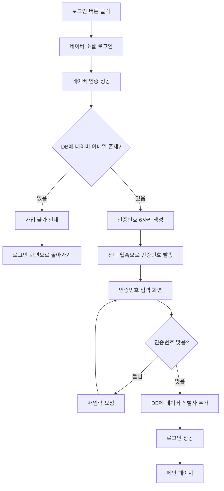
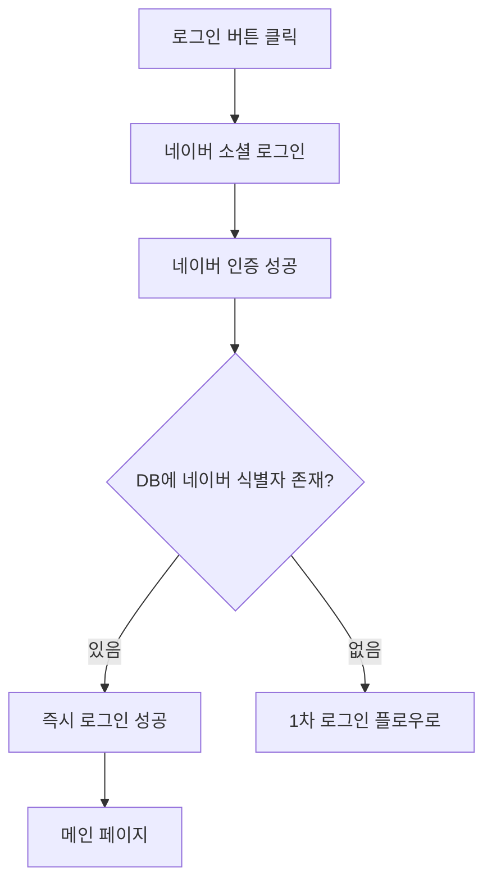

# 🔐 네이버 소셜 로그인 시스템 설계 가이드

TestPark 프로젝트의 네이버 소셜 로그인 시스템 구현을 위한 상세 가이드입니다.

## 📋 목차

1. [시스템 개요](#-시스템-개요)
2. [전체 플로우](#-전체-플로우)
3. [데이터베이스 설계](#-데이터베이스-설계)
4. [네이버 API 연동](#-네이버-api-연동)
5. [인증번호 시스템](#-인증번호-시스템)
6. [구현 단계](#-구현-단계)
7. [보안 고려사항](#-보안-고려사항)

## 🎯 시스템 개요

### 핵심 로직
1. **사전 데이터 입력**: DB에 네이버 식별자를 제외한 모든 사용자 정보가 미리 입력됨
2. **네이버 인증**: 네이버 소셜 로그인으로 사용자 확인
3. **이메일 매칭**: 네이버 이메일과 DB 이메일 매칭 확인
4. **인증번호 인증**: 잔디 웹훅으로 6자리 인증번호 발송 및 확인
5. **식별자 연동**: 인증 성공 시 네이버 식별자를 DB에 추가
6. **로그인 완성**: 이후 네이버 식별자로 자동 로그인

### 사용자 시나리오
- **신규 사용자**: 네이버 이메일이 DB에 없음 → 가입불가 안내
- **기존 사용자 (최초)**: 네이버 이메일 있음 → 인증번호 → 식별자 연동
- **기존 사용자 (재방문)**: 네이버 식별자 있음 → 즉시 로그인

## 🔄 전체 플로우

### 1차 로그인 (네이버 식별자 없음)


### 2차 이후 로그인 (네이버 식별자 있음)


## 🗃️ 데이터베이스 설계

### User 모델 확장
```python
from django.contrib.auth.models import AbstractUser
from django.db import models

class CustomUser(AbstractUser):
    # 기본 필드들 (사전 입력됨)
    email = models.EmailField(unique=True)  # 네이버 이메일 매칭용
    name = models.CharField(max_length=100)
    phone = models.CharField(max_length=20)
    department = models.CharField(max_length=100)
    position = models.CharField(max_length=100)

    # 네이버 소셜 로그인 필드들
    naver_id = models.CharField(max_length=100, blank=True, null=True, unique=True)
    naver_email = models.EmailField(blank=True, null=True)
    naver_name = models.CharField(max_length=100, blank=True, null=True)

    # 인증번호 관련 필드들
    auth_code = models.CharField(max_length=6, blank=True, null=True)
    auth_code_expires = models.DateTimeField(blank=True, null=True)

    # 메타 정보
    is_naver_linked = models.BooleanField(default=False)
    created_at = models.DateTimeField(auto_now_add=True)
    updated_at = models.DateTimeField(auto_now=True)

    def __str__(self):
        return f"{self.email} - {self.name}"
```

### 인증 세션 모델
```python
class AuthSession(models.Model):
    session_key = models.CharField(max_length=255, unique=True)
    user = models.ForeignKey(CustomUser, on_delete=models.CASCADE, null=True, blank=True)
    naver_data = models.JSONField()  # 네이버에서 받은 데이터 임시 저장
    auth_code = models.CharField(max_length=6)
    expires_at = models.DateTimeField()
    is_verified = models.BooleanField(default=False)
    created_at = models.DateTimeField(auto_now_add=True)
```

## 🔗 네이버 API 연동

### 1. 네이버 개발자 센터 설정

#### 🔧 실서버 배포를 위한 설정 변경 (중요!)

**네이버 개발자 센터에서 반드시 변경해야 할 설정:**

1. [네이버 개발자 센터](https://developers.naver.com/apps/)에 로그인
2. 등록된 애플리케이션 선택
3. **API 설정** → **네이버 로그인** 항목에서:
   ```
   서비스 URL: https://carpenterhosting.cafe24.com
   Callback URL: https://carpenterhosting.cafe24.com/auth/naver/callback/
   ```

**⚠️ 주의사항:**
- 서비스 URL과 Callback URL이 실서버 도메인과 정확히 일치해야 함
- HTTPS 사용 필수 (HTTP는 네이버에서 허용하지 않음)
- 변경 후 적용까지 몇 분 소요될 수 있음

```bash
# 현재 설정된 정보
CLIENT_ID = '_mw6kojqJVXoWEBqYBKv'
CLIENT_SECRET = 'hHKrIfKoMA'
REDIRECT_URI = 'https://carpenterhosting.cafe24.com/auth/naver/callback/'
```

### 2. 네이버 로그인 URL 생성
```python
import urllib.parse

def get_naver_login_url():
    state = generate_random_state()  # CSRF 방지용
    params = {
        'response_type': 'code',
        'client_id': settings.NAVER_CLIENT_ID,
        'redirect_uri': settings.NAVER_REDIRECT_URI,
        'state': state
    }
    base_url = 'https://nid.naver.com/oauth2.0/authorize'
    return f"{base_url}?{urllib.parse.urlencode(params)}", state
```

### 3. 액세스 토큰 획득
```python
def get_naver_access_token(code, state):
    token_url = 'https://nid.naver.com/oauth2.0/token'
    data = {
        'grant_type': 'authorization_code',
        'client_id': settings.NAVER_CLIENT_ID,
        'client_secret': settings.NAVER_CLIENT_SECRET,
        'code': code,
        'state': state
    }

    response = requests.post(token_url, data=data)
    return response.json()
```

### 4. 사용자 정보 조회
```python
def get_naver_user_info(access_token):
    headers = {'Authorization': f'Bearer {access_token}'}
    response = requests.get('https://openapi.naver.com/v1/nid/me', headers=headers)
    return response.json()
```

## 📱 인증번호 시스템

### 1. 인증번호 생성
```python
import random
import string

def generate_auth_code():
    return ''.join(random.choices(string.digits, k=6))
```

### 2. 잔디 웹훅 발송
```python
import requests
from datetime import datetime, timedelta

def send_auth_code_to_jandi(user_email, auth_code):
    webhook_url = 'https://wh.jandi.com/connect-api/webhook/your_webhook_url'

    message = {
        "body": f"🔐 TestPark 인증번호",
        "connectColor": "#0066CC",
        "connectInfo": [
            {
                "title": "인증번호",
                "description": f"**{auth_code}**"
            },
            {
                "title": "이메일",
                "description": user_email
            },
            {
                "title": "유효시간",
                "description": "5분"
            }
        ]
    }

    response = requests.post(webhook_url, json=message)
    return response.status_code == 200
```

### 3. 인증번호 검증
```python
from django.utils import timezone

def verify_auth_code(session_key, input_code):
    try:
        auth_session = AuthSession.objects.get(
            session_key=session_key,
            auth_code=input_code,
            expires_at__gte=timezone.now(),
            is_verified=False
        )
        auth_session.is_verified = True
        auth_session.save()
        return True, auth_session
    except AuthSession.DoesNotExist:
        return False, None
```

## 🚀 구현 단계

### Phase 1: 기본 설정
- [ ] Django 앱 생성 (`accounts`)
- [ ] CustomUser 모델 설정
- [ ] 네이버 API 설정 및 테스트
- [ ] 기본 URL 및 뷰 구조 설정

### Phase 2: 네이버 소셜 로그인
- [ ] 네이버 로그인 버튼 및 페이지
- [ ] 네이버 OAuth 콜백 처리
- [ ] 사용자 정보 조회 및 매칭

### Phase 3: 인증번호 시스템
- [ ] 인증번호 생성 및 발송
- [ ] 잔디 웹훅 연동
- [ ] 인증번호 입력 및 검증

### Phase 4: 사용자 연동
- [ ] 네이버 식별자 DB 저장
- [ ] 로그인 세션 관리
- [ ] 재방문 시 자동 로그인

### Phase 5: UI/UX 개선
- [ ] 로그인 화면 디자인
- [ ] 인증번호 입력 화면
- [ ] 에러 메시지 및 안내 화면
- [ ] 모바일 반응형 대응

## 🔒 보안 고려사항

### 1. CSRF 공격 방지
- `state` 파라미터로 CSRF 토큰 사용
- Django CSRF 미들웨어 활용

### 2. 세션 보안
- 인증번호 만료시간 설정 (5분)
- 세션 하이재킹 방지
- HTTPS 강제 사용

### 3. 데이터 보안
- 네이버 액세스 토큰 즉시 폐기
- 인증번호 해시 저장 고려
- 개인정보 로깅 금지

### 4. API 보안
- 네이버 API 호출 제한
- 잔디 웹훅 URL 보안
- 환경변수로 설정 관리

## 📱 API 엔드포인트 설계

### 로그인 관련
- `GET /auth/login/` - 로그인 페이지
- `GET /auth/naver/` - 네이버 로그인 리다이렉트
- `GET /auth/naver/callback/` - 네이버 콜백 처리

### 인증번호 관련
- `POST /auth/send-code/` - 인증번호 발송
- `POST /auth/verify-code/` - 인증번호 검증
- `GET /auth/verify/` - 인증번호 입력 페이지

### 사용자 관리
- `GET /auth/profile/` - 사용자 프로필
- `POST /auth/logout/` - 로그아웃
- `GET /auth/status/` - 로그인 상태 확인

## 🧪 테스트 계획

### 1. 단위 테스트
- 네이버 API 연동 테스트
- 인증번호 생성/검증 테스트
- 사용자 매칭 로직 테스트

### 2. 통합 테스트
- 전체 로그인 플로우 테스트
- 에러 케이스 테스트
- 보안 취약점 테스트

### 3. 사용자 테스트
- 실제 네이버 계정으로 테스트
- 다양한 시나리오 테스트
- UI/UX 사용성 테스트

---

## 💡 구현 순서

1. **기본 환경 설정** → 네이버 API 연동 테스트
2. **데이터베이스 모델** → 마이그레이션 실행
3. **네이버 로그인 구현** → 기본 플로우 확인
4. **인증번호 시스템** → 잔디 웹훅 테스트
5. **전체 통합 테스트** → 실제 시나리오 검증

이 가이드를 바탕으로 단계별로 구현해나가겠습니다! 🚀